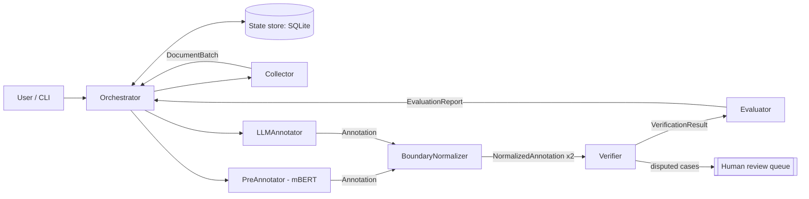

# DESIGN — kazner-agents

## 1. Task and motivation
Input: a Kazakh text source (a Kazakh Wikipedia article, a local text file, or a sample of the
KazNERD test split). Output: the text split into sentences and words, each word labelled in IOB2
with one of the 25 KazNERD entity types, plus a list of uncertain cases for human review and a
quality report.

Why it matters for the thesis: the thesis needs an out-of-domain evaluation set (Assignment 2 of
the ASD course, requirement FR1) and studies LLM-based NER for Kazakh (work package WP3). This
system produces such data and, as a by-product, measures how well an LLM annotates Kazakh entities
compared with the fine-tuned mBERT from the pilot study.

## 2. Why a team of agents rather than one agent
1. Generation and verification must be separated. LLMs hallucinate (an explicit limitation in the
   course lecture on LLMs), and an agent does not reliably catch its own errors. Professional
   annotation follows the same principle: independent annotators, a reviewer and an adjudicator.
2. Heterogeneous knowledge sources. A fine-tuned mBERT, a general-purpose LLM and rule-based Kazakh
   morphology fail in different ways. The value of the system lies in comparing them; one agent
   holding all three would blur where each decision came from.
3. Human control. Disputed cases are routed to a person instead of being decided silently
   (UNESCO principle of human oversight; course lecture on AI ethics).
4. Replaceability. Each annotator is behind the same message interface, so the thesis can swap the
   LLM or the encoder and compare them under identical conditions.

## 3. Architecture
Interaction scheme: orchestrator (hub-and-spoke) + per-batch pipeline + shared state store.



The Orchestrator only plans and routes: it decides batch size and order, sends requests, stores
state and applies limits. It never annotates, judges, evaluates or writes output files.

The arrows show the logical flow of data. Physically every message goes through the
Orchestrator: an agent returns its output payloads, and the Orchestrator wraps each one in an
envelope, looks up the recipient in a fixed routing table (§5), logs and stores it, checks the
limits and loop protection (§7), and only then delivers it. This is what makes hub-and-spoke
control possible: no message can bypass the step counter or the loop check.

## 4. Agents

| Agent | Role (one) | Input | Output | Tools (≤ 5) | Done when |
|---|---|---|---|---|---|
| Orchestrator | Plan batches, route messages, enforce limits | Task (source, options) | Final RunSummary | State store | All batches have an EvaluationReport, or a limit is hit |
| Collector | Fetch text, split into sentences and words, record provenance | CollectRequest | DocumentBatch | Wikipedia API; file reader; sentence/word splitter | All requested sentences emitted with source URL and licence |
| PreAnnotator | Label words with the fine-tuned mBERT (A4) | DocumentBatch | Annotation (source = mbert) | mBERT inference | Every word has a label |
| LLMAnnotator | Label words with an LLM using few-shot KazNERD examples | DocumentBatch | Annotation (source = llm) | LLM; few-shot example store | Valid JSON for every sentence |
| BoundaryNormalizer | Convert spans to word-level IOB2, repair invalid spans and sequences, validate labels | Annotation (spans or IOB2 labels) | NormalizedAnnotation | IOB2 validator; label set | Output passes validation |
| Verifier | Compare the two annotations; accept agreement, adjudicate or escalate disagreement | 2 × NormalizedAnnotation | VerificationResult | LLM (adjudication); guideline rules; human-review queue | Every disagreement is resolved or escalated |
| Evaluator | Score against gold when available; otherwise report agreement or a summary; export dataset | VerificationResult (+ gold); in A2 NormalizedAnnotation | EvaluationReport, exported files | kazner evaluator (A4); file exporter; state store | Report and exports written |

Six agents plus the orchestrator. No role overlaps: only the annotators label, only the Verifier
judges, only the Evaluator measures.

## 5. Messages
Every message is a pydantic model wrapped in an envelope:

```json
{
  "msg_id": "uuid", "run_id": "uuid", "step": 7,
  "sender": "LLMAnnotator", "recipient": "BoundaryNormalizer",
  "type": "Annotation", "created_at": "ISO-8601",
  "payload": { }
}
```

`run_id` is a readable string `YYYYMMDD-HHMMSS-xxxx` (time plus 4 random hex digits), so it can
be typed in `kna load-report <run_id>`. `msg_id` is a uuid4. The envelope `type` must equal the
class name of the payload; this is validated.

Payloads:
- `CollectRequest` — source (`wikipedia` | `file` | `kaznerd_test`), title or path, max_sentences, batch_size.
- `DocumentBatch` — batch_id, doc_id, source_url, licence, sentences: list of {sentence_id, words: [str]}; for `kaznerd_test` also gold labels.
- `Annotation` — batch_id, annotator (`mbert` | `llm`), per sentence: sentence_id, words, notes, and
  exactly one of `entities` (spans {start_word, end_word, type, text}, word indices inclusive) or
  `labels` (IOB2, one per word). The LLM produces spans; the mBERT tagger (A4) produces labels.
- `NormalizedAnnotation` — batch_id, annotator, per sentence: sentence_id, words, labels (valid
  IOB2, one per word), repairs (readable descriptions); repairs_applied: int for the batch.
- `VerificationResult` — batch_id, per sentence: final labels, decision per disagreement (`agreed` | `adjudicated` | `escalated`), rationale.
- `EvaluationReport` — batch_id, mode (`gold` | `agreement` | `summary`), P/R/F1 or agreement rate
  (null in `summary` mode), counts, export paths. `summary` is the A2 mode: one annotator, no gold.

Words travel inside the annotation messages so that each agent can work from the message alone
and can be tested in isolation. Provenance (source URL, licence) stays in the `DocumentBatch`
stored in the state store; the Evaluator looks it up there when exporting.

Routing table used by the Orchestrator (A2; A4 adds the Verifier between the Normalizer and the
Evaluator):

| Payload | Recipient |
|---|---|
| CollectRequest | Collector |
| DocumentBatch | LLMAnnotator (A4: also PreAnnotator) |
| Annotation | BoundaryNormalizer |
| NormalizedAnnotation | Evaluator (A4: Verifier) |
| VerificationResult | Evaluator |
| EvaluationReport | Orchestrator (end of the batch) |

The LLM is asked for entities as word-index spans, not labels per word and not character offsets:
spans are easier for the model, and word indices remove any ambiguity with Kazakh suffixes.
LLMs miscount indices, so the prompt shows every word with its index (`0:Атырау 1:…`) and the
model also returns the span `text`. The BoundaryNormalizer checks that `words[start..end]` equals
`text`; if not, it looks for the text nearby and moves the span, otherwise it drops the span and
records a repair. Sentences with repairs go to the human-review list.

## 6. Technology decisions
- Plain Python with an explicit orchestrator, not an agent framework: fully traceable control flow,
  no hidden prompts, easy to log and to explain at the exam.
- pydantic for typed messages: validation at every boundary, JSON for logs.
- SQLite for state: one file, no server, durable across crashes.
- OpenAI API via one client wrapper; a FakeLLM backend for tests and offline demos.
- Model: `gpt-6-luna` with reasoning effort `low` (inexpensive current model, supports Structured
  Outputs; checked against OpenAI's documentation in October 2026). Configurable via `KNA_MODEL`.
  The call uses the Responses API, `client.responses.parse(..., text_format=<pydantic model>)`,
  with a strict JSON schema: every field required, no extra fields, entity type as an enum of
  the 25 labels. The schema for the LLM answer is a small model of its own, separate from the
  message models.

## 7. Reliability and safety
- Limits: max steps per run (default 60), wall-clock timeout (default 300 s), timeout per LLM call
  (default 60 s), max LLM calls per run (default 40). A step is one delivered message. In A2 a run
  takes 1 step for the CollectRequest plus 4 per batch (DocumentBatch, Annotation,
  NormalizedAnnotation, EvaluationReport), so 60 steps allow 14 batches (140 sentences at batch
  size 10).
- External APIs: Wikimedia requires a descriptive User-Agent; it is set in config
  (`KNA_USER_AGENT`).
- Loop protection: the orchestrator rejects a repeated (batch_id, message type, sender, recipient)
  key beyond 2 attempts; Verifier → Annotator revision is allowed once at most. The sender is part
  of the key because in A4 the Normalizer legitimately receives two Annotations per batch (mbert
  and llm), and a revision would otherwise be the rejected third one.
- Errors: 3 retries (4 attempts) with exponential backoff (1 s, 2 s, 4 s) for network and API
  calls; the OpenAI SDK's own retries are switched off (`max_retries=0`) so retries do not nest.
  On final failure the batch is marked `failed` in state with a readable reason, and the run
  continues with the next batch. Hitting a run limit (steps, time, LLM calls) stops the run; the
  remaining batches are marked `skipped`.
- Time budget: the orchestrator checks the wall-clock deadline before every step, and the LLM
  client never starts an attempt with less than 1 s left and caps each attempt's timeout at the
  remaining time. Without this, one call (4 × 60 s + backoff) could use the whole 300 s budget.
- The LLM call cap counts every attempt, because every attempt may cost money.
- Keys: `.env` only. Data provenance: every document stores its source URL and licence.

## 8. Load balance (typical scenario)
Typical scenario: one Wikipedia article, 20 sentences, batch size 10 → 2 batches.

Counting rules (what `kna load-report` counts):
- Only records of kind `llm` and `tool` count; `message` records do not.
- One record is one logical call. Retries are stored in the record's `attempts` field and do not
  create extra records.
- State store writes are tool calls of the Orchestrator: one to create the run (the plan), one
  per batch (final batch status) and one to finish the run. Saving a message together with its
  log record is part of message delivery, not a separate tool call.

A2 (agents built now):

| Agent | Calls | Total | Share |
|---|---|---|---|
| Orchestrator | create run ×1, batch status ×1 per batch, finish run ×1 | 4 | 27% |
| Collector | run-level: fetch ×1, split ×1 | 2 | 13% |
| LLMAnnotator | few-shot store ×1 per run, LLM ×1 per batch | 3 | 20% |
| BoundaryNormalizer | validator ×1 per Annotation | 2 | 13% |
| Evaluator | state lookup ×1, export ×1 per batch | 4 | 27% |
| Total |  | 15 | max 27% ≤ 40% ✓ |

A4 (all agents): PreAnnotator +2 (inference per batch), BoundaryNormalizer +2 (second
Annotation per batch), Verifier +2 (adjudication per batch, only if disagreements) → 21 calls,
max 4/21 = 19%.

With a single batch the A2 shares are 3/10 for the Orchestrator and 3/10 for the Evaluator, still
below 40%. This is a design estimate; `kna load-report` measures the real shares from the logs.
A run that stops early (e.g. the article does not exist) can legitimately fail the 40% check.

## 9. Scope by stage

### Assignment 2 — build now
- Package skeleton, `.env.example`, README (setup, run, example, Mermaid diagram, agents table).
- Envelope + all payload models (even for agents not yet implemented).
- Orchestrator with state store, limits and loop protection.
- Collector (Wikipedia API + file), LLMAnnotator (real OpenAI + FakeLLM), BoundaryNormalizer,
  and the Evaluator in `summary` mode (counts per entity type, repairs, export of IOB2 output and
  the human-review list) → four agents exchanging typed messages end to end. The Evaluator is in
  A2 so that the Orchestrator does no domain work (export) and the prototype has four agents.
- JSONL logging and `kna load-report`. Log records hold metadata only (no text), so the log of a
  typical run is committed to `docs/example-run/` as the evidence of load balance.
- Few-shot examples: ~15 short KazNERD training sentences covering all 25 types, selected by a
  deterministic script and committed with attribution (KazNERD is CC BY 4.0).
- CLI: `kna run --source wikipedia --title "<title>" --max-sentences 10 [--llm fake|openai]`
  writing IOB2 output to `outputs/<run_id>/`.
- Tests listed in CLAUDE.md.
- `docs/agents.md` generated from §4 and `docs/messages.md` from §5, kept in sync with the code.

### Assignment 4 — later
PreAnnotator (fine-tuned mBERT checkpoint from the pilot), Verifier, Evaluator `gold` and
`agreement` modes (via `kazner`),
human-review queue, the `kaznerd_test` source with gold labels, at least 5 test scenarios with
expected results.

### Exam
10+ scenarios with measured F1 and agreement, final report and slides.

## 10. Label set
The 25 KazNERD entity types, read from the pilot data (`../ner-project/data`, identical in the
train, valid and test splits): ADAGE, ART, CARDINAL, CONTACT, DATE, DISEASE, EVENT, FACILITY, GPE,
LANGUAGE, LAW, LOCATION, MISCELLANEOUS, MONEY, NON_HUMAN, NORP, ORDINAL, ORGANISATION,
PERCENTAGE, PERSON, POSITION, PRODUCT, PROJECT, QUANTITY, TIME. They are written out in
`labels.py`; a test checks them against the data when the data folder is available.

Notes from the data: the train split contains 16 invalid IOB2 starts (`I-` without `B-`); valid
and test contain none. Tokenisation: punctuation is always a separate token (including the dot
of abbreviations and the comma in `12 , 4`); hyphenated words and ordinals (`1-інші`) are one
token. The Collector's word splitter follows these conventions.

Few-shot examples for the LLMAnnotator come from the KazNERD training split. KazNERD is released
under CC BY 4.0 (ISSAI, Yeshpanov et al., LREC 2022), so a small selection is stored in the
repository with attribution. Kazakh Wikipedia text is CC BY-SA 4.0; exports derived from it carry
that licence in their provenance.
