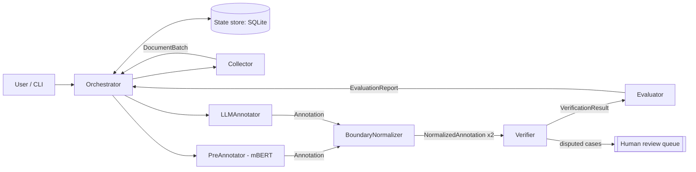

# DESIGN — kazner-agents

## 1. Task and motivation
Input: a Kazakh text source (a Kazakh Wikipedia article, a local text file, or a sample of the
KazNERD test split). Output: the text split into sentences and words, each word labelled in IOB2
with one of the 25 KazNERD entity types, plus a list of uncertain cases for human review and a
quality report.

Why it matters for the thesis: the thesis needs an out-of-domain evaluation set (Assignment 2 of
the ASD course, requirement FR1) and studies LLM-based NER for Kazakh (work package WP3). This
system produces such data and, as a by-product, measures how well an LLM annotates Kazakh entities
compared with the fine-tuned mBERT from the pilot study.

## 2. Why a team of agents rather than one agent
1. Generation and verification must be separated. LLMs hallucinate (an explicit limitation in the
   course lecture on LLMs), and an agent does not reliably catch its own errors. Professional
   annotation follows the same principle: independent annotators, a reviewer and an adjudicator.
2. Heterogeneous knowledge sources. A fine-tuned mBERT, a general-purpose LLM and rule-based Kazakh
   morphology fail in different ways. The value of the system lies in comparing them; one agent
   holding all three would blur where each decision came from.
3. Human control. Disputed cases are routed to a person instead of being decided silently
   (UNESCO principle of human oversight; course lecture on AI ethics).
4. Replaceability. Each annotator is behind the same message interface, so the thesis can swap the
   LLM or the encoder and compare them under identical conditions.

## 3. Architecture
Interaction scheme: orchestrator (hub-and-spoke) + per-batch pipeline + shared state store.



The Orchestrator only plans and routes: it decides batch size and order, sends requests, stores
state and applies limits. It never annotates, judges or evaluates.

## 4. Agents

| Agent | Role (one) | Input | Output | Tools (≤ 5) | Done when |
|---|---|---|---|---|---|
| Orchestrator | Plan batches, route messages, enforce limits | Task (source, options) | Final RunSummary | State store | All batches have an EvaluationReport, or a limit is hit |
| Collector | Fetch text, split into sentences and words, record provenance | CollectRequest | DocumentBatch | Wikipedia API; file reader; sentence/word splitter | All requested sentences emitted with source URL and licence |
| PreAnnotator | Label words with the fine-tuned mBERT (A4) | DocumentBatch | Annotation (source = mbert) | mBERT inference | Every word has a label |
| LLMAnnotator | Label words with an LLM using few-shot KazNERD examples | DocumentBatch | Annotation (source = llm) | LLM; few-shot example store | Valid JSON for every sentence |
| BoundaryNormalizer | Convert spans to word-level IOB2, repair invalid sequences, validate labels | Annotation | NormalizedAnnotation | IOB2 validator; label set | Output passes validation |
| Verifier | Compare the two annotations; accept agreement, adjudicate or escalate disagreement | 2 × NormalizedAnnotation | VerificationResult | LLM (adjudication); guideline rules; human-review queue | Every disagreement is resolved or escalated |
| Evaluator | Score against gold when available; otherwise report agreement; export dataset | VerificationResult (+ gold) | EvaluationReport, exported files | kazner evaluator (A4); file exporter; state store | Report and exports written |

Six agents plus the orchestrator. No role overlaps: only the annotators label, only the Verifier
judges, only the Evaluator measures.

## 5. Messages
Every message is a pydantic model wrapped in an envelope:

```json
{
  "msg_id": "uuid", "run_id": "uuid", "step": 7,
  "sender": "LLMAnnotator", "recipient": "BoundaryNormalizer",
  "type": "Annotation", "created_at": "ISO-8601",
  "payload": { }
}
```

Payloads:
- `CollectRequest` — source (`wikipedia` | `file` | `kaznerd_test`), title or path, max_sentences, batch_size.
- `DocumentBatch` — batch_id, doc_id, source_url, licence, sentences: list of {sentence_id, words: [str]}; for `kaznerd_test` also gold labels.
- `Annotation` — batch_id, annotator (`mbert` | `llm`), per sentence: entities as {start_word, end_word, type} (word indices, inclusive).
- `NormalizedAnnotation` — batch_id, annotator, per sentence: labels (IOB2, one per word), repairs_applied: int.
- `VerificationResult` — batch_id, per sentence: final labels, decision per disagreement (`agreed` | `adjudicated` | `escalated`), rationale.
- `EvaluationReport` — batch_id, mode (`gold` | `agreement`), P/R/F1 or agreement rate, counts, export paths.

The LLM is asked for entities as word-index spans, not labels per word and not character offsets:
spans are easier for the model, and word indices remove any ambiguity with Kazakh suffixes.

## 6. Technology decisions
- Plain Python with an explicit orchestrator, not an agent framework: fully traceable control flow,
  no hidden prompts, easy to log and to explain at the exam.
- pydantic for typed messages: validation at every boundary, JSON for logs.
- SQLite for state: one file, no server, durable across crashes.
- OpenAI API via one client wrapper; a FakeLLM backend for tests and offline demos.

## 7. Reliability and safety
- Limits: max steps per run (default 60), wall-clock timeout (default 300 s), timeout per LLM call
  (default 60 s), max LLM calls per run (default 40).
- Loop protection: the orchestrator rejects a repeated (batch_id, message type, recipient) triple
  beyond 2 attempts; Verifier → Annotator revision is allowed once at most.
- Errors: 3 retries with exponential backoff for network and API calls; on final failure the batch
  is marked `failed` in state with a readable reason, and the run continues with the next batch.
- Keys: `.env` only. Data provenance: every document stores its source URL and licence.

## 8. Load balance (typical scenario)
Typical scenario: one Wikipedia article, 20 sentences, batch size 10 → 2 batches.

| Agent | Calls per batch | Total | Share |
|---|---|---|---|
| Orchestrator | state write ×1 (+1 plan for the run) | 3 | 20% |
| Collector | — (run-level: fetch ×1, split ×1) | 2 | 13% |
| PreAnnotator | inference ×1 | 2 | 13% |
| LLMAnnotator | LLM ×1 | 2 | 13% |
| BoundaryNormalizer | validator ×1 (both annotations in one call) | 2 | 13% |
| Verifier | LLM adjudication ×1 (only if disagreements) | 2 | 13% |
| Evaluator | evaluate ×1 | 2 | 13% |
| Total |  | 15 | max 20% ≤ 40% ✓ |

This is a design estimate; `kna load-report` measures the real shares from the logs.

## 9. Scope by stage

### Assignment 2 — build now
- Package skeleton, `.env.example`, README (setup, run, example, Mermaid diagram, agents table).
- Envelope + all payload models (even for agents not yet implemented).
- Orchestrator with state store, limits and loop protection.
- Collector (Wikipedia API + file), LLMAnnotator (real OpenAI + FakeLLM), BoundaryNormalizer.
  → three agents exchanging typed messages end to end.
- JSONL logging and `kna load-report`.
- CLI: `kna run --source wikipedia --title "<title>" --max-sentences 10 [--llm fake|openai]`
  writing IOB2 output to `outputs/<run_id>/`.
- Tests listed in CLAUDE.md.
- `docs/agents.md` generated from §4 and `docs/messages.md` from §5, kept in sync with the code.

### Assignment 4 — later
PreAnnotator (fine-tuned mBERT checkpoint from the pilot), Verifier, Evaluator (via `kazner`),
human-review queue, the `kaznerd_test` source with gold labels, at least 5 test scenarios with
expected results.

### Exam
10+ scenarios with measured F1 and agreement, final report and slides.

## 10. Label set
The 25 KazNERD entity types. Read the authoritative list from the pilot data
(`../ner-project/data`) rather than hard-coding it from memory. Few-shot examples for the
LLMAnnotator come from the KazNERD training split; check the dataset licence before storing any
example sentences in this repository.
