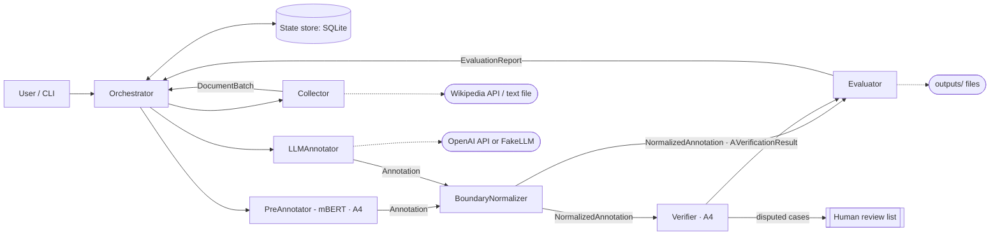

# kazner-agents

A multi-agent AI system that produces **word-level named-entity annotations for Kazakh text**
(IOB2, the 25 entity types of KazNERD). Course project for *Artificial Intelligence and Machine
Learning*; it supports an MSc thesis on adapting language models to Kazakh, where it builds an
out-of-domain evaluation set and measures LLM-based NER against a fine-tuned mBERT.

Current stage: **Assignment 2** — architecture, agent specification and a working prototype in
which four agents exchange typed messages end to end. The full specification is in
[DESIGN.md](DESIGN.md).

## Why a team of agents

1. **Generation and verification are separated.** LLMs hallucinate and do not reliably catch
   their own errors; professional annotation uses independent annotators and a reviewer.
2. **Different knowledge sources** (fine-tuned mBERT, a general LLM, rules) fail in different ways;
   keeping them in separate agents shows where each decision came from.
3. **Human control.** Doubtful sentences go to a human-review list instead of being decided
   silently (UNESCO principle of human oversight).
4. **Replaceability.** Every annotator sits behind the same message interface, so the thesis can
   swap the LLM or the encoder and compare them under identical conditions.

## Architecture

Orchestrator (hub-and-spoke) + per-batch pipeline + shared state store (SQLite). Every message
physically passes through the Orchestrator, which looks up the recipient in a fixed routing
table, checks the limits and the loop protection, saves and logs the message, and delivers it.



Agents marked A4 are specified now and built in Assignment 4. In A2 the Evaluator receives the
NormalizedAnnotation directly and runs in `summary` mode.

## Agents

| Agent | Stage | Role | Input → Output | Tools |
|---|---|---|---|---|
| Orchestrator | A2 | Plan batches, route messages, enforce limits | CollectRequest → RunSummary | state store |
| Collector | A2 | Fetch text, split into sentences and words, record provenance | CollectRequest → DocumentBatch | Wikipedia API; file reader; sentence/word splitter |
| LLMAnnotator | A2 | Label entities with an LLM using few-shot KazNERD examples | DocumentBatch → Annotation (spans) | LLM; few-shot example store |
| BoundaryNormalizer | A2 | Spans → word-level IOB2; repair invalid spans/sequences; validate | Annotation → NormalizedAnnotation | IOB2 validator; label set |
| Evaluator | A2 | Summary (A2) / agreement / gold scores; export the dataset | NormalizedAnnotation → EvaluationReport | state store; file exporter; kazner evaluator (A4) |
| PreAnnotator | A4 | Label words with the fine-tuned mBERT | DocumentBatch → Annotation (IOB2) | mBERT inference |
| Verifier | A4 | Compare annotations; agree, adjudicate or escalate | 2 × NormalizedAnnotation → VerificationResult | LLM; guideline rules; human-review queue |

The full table with completion criteria is generated from the code:
[docs/agents.md](docs/agents.md). All message formats, field by field, and the routing table:
[docs/messages.md](docs/messages.md).

### Message example

A real message from the example run (FakeLLM; one sentence of the batch shown):

```json
{
  "msg_id": "776472f5-8278-4859-99b6-8c85b23f59f7",
  "run_id": "20261008-123736-1ef6", "step": 3,
  "sender": "LLMAnnotator", "recipient": "BoundaryNormalizer",
  "type": "Annotation", "created_at": "2026-10-08T07:37:37.797755Z",
  "payload": {
    "batch_id": "b001", "annotator": "llm",
    "sentences": [{
      "sentence_id": "kkwiki-абай-құнанбайұлы-s0002",
      "words": ["Абай", "Шығыс", "пен", "Батыс", "мәдениетін", "жетік", "білген", "."],
      "entities": [
        {"start_word": 1, "end_word": 1, "type": "GPE", "text": "Шығыс"},
        {"start_word": 3, "end_word": 3, "type": "GPE", "text": "Батыс"}
      ],
      "labels": null, "notes": []
    }]
  }
}
```

## Setup (Windows PowerShell)

Requires Python 3.11.

```powershell
py -3.11 -m venv .venv
.venv\Scripts\Activate.ps1
pip install -e ".[dev]"
```

To use the real OpenAI model, copy `.env.example` to `.env` and put your key in it. `.env` is
gitignored; the key is never printed or logged. Without `.env` everything works with the
offline FakeLLM.

## Usage

```powershell
# Offline: Wikipedia article, deterministic FakeLLM (no OpenAI calls, no cost)
kna run --source wikipedia --title "Абай Құнанбайұлы" --max-sentences 20 --batch-size 10 --llm fake

# A local UTF-8 text file
kna run --source file --path my_text.txt --llm fake

# Real LLM (needs OPENAI_API_KEY in .env); prints token usage and estimated cost
kna run --source wikipedia --title "Абай Құнанбайұлы" --max-sentences 20 --llm openai

# Each agent's share of LLM + tool calls; exit code 1 if any agent is over 40%
kna load-report latest

# Regenerate docs/agents.md and docs/messages.md from the code (--check: only verify)
kna docs
```

A run writes:

- `outputs/<run_id>/annotations.iob2`: KazNERD format, `word LABEL` per line, blank line between sentences;
- `outputs/<run_id>/sentences.jsonl`: one sentence per line with labels and provenance (source URL, licence);
- `outputs/<run_id>/review.jsonl`: sentences a person should check, with the reasons (only if there are any);
- `logs/<run_id>.jsonl`: one record per message, tool call and LLM call;
- `state/kna.sqlite3`: runs, batch statuses and every delivered message.

### Example run (typical scenario)

One Wikipedia article, 20 sentences, batch size 10, so 2 batches. The full log and report are in
[docs/example-run/](docs/example-run/).

```text
run 20261008-123736-1ef6: completed
  b001: done
  b002: done
steps: 9, entities: 36, sentences for review: 0
LLM: 2 calls to FakeLLM (estimated tokens, no cost), tokens in/out: 4969/962

Agent                 LLM  Tool  Total   Share
Evaluator               0     4      4   26.7%
Orchestrator            0     4      4   26.7%
LLMAnnotator            2     1      3   20.0%
BoundaryNormalizer      0     2      2   13.3%
Collector               0     2      2   13.3%
Total                   2    13     15

OK: no agent over the limit
```

Output excerpt (`annotations.iob2`). With `--llm fake` the labels come from a crude
capitalisation heuristic that only exercises the pipeline; it is **not** real NER:

```text
Әкесі O
Құнанбай B-PERSON
Өскенбайұлы I-PERSON
```

## How the LLM is used

- Model: `gpt-6-luna` with reasoning effort `low`, configurable in `.env`. It was chosen as an
  inexpensive current OpenAI model with Structured Outputs; about $0.001 per batch of 10 sentences.
- One call per batch through the Responses API with **Structured Outputs**: the answer must match a
  strict JSON schema (entity type is an enum of the 25 KazNERD labels).
- The prompt follows the structure from the lecture on prompt engineering: *Role, Task, Context
  (25 entity types with short descriptions), numbered Steps, few-shot Examples, Output format*,
  with delimiters (`<sentences>…</sentence>`).
- Few-shot: 23 short KazNERD training sentences that together cover all 25 types, selected
  deterministically by [scripts/select_fewshot.py](scripts/select_fewshot.py).
- LLMs miscount word indices, so every word is shown with its index (`0:Абай 1:Шығыс …`) and the
  model also returns the span text. The BoundaryNormalizer moves or drops spans whose text does
  not match and sends those sentences to the review list.

## Reliability and safety

- **Limits** (in `.env`): max 60 steps (delivered messages) per run, 300 s per run, 60 s per LLM
  call, 40 LLM calls per run. Every attempt counts towards the LLM cap.
- **Loop protection**: the same `(batch, message type, sender, recipient)` is delivered at most
  twice; the third time it is rejected and the batch fails.
- **Errors**: network and API calls are retried 3 times with exponential backoff (1 s, 2 s, 4 s);
  the OpenAI SDK's own retries are off. A failed batch is marked `failed` with a readable reason and
  the run continues; a limit stops the run and the remaining batches are marked `skipped`.
- **Logging**: every message, tool call and LLM call (with token counts) goes to
  `logs/<run_id>.jsonl`. Records hold metadata only, never the annotated text.
- **Keys** only in `.env` (gitignored). **One LLM client** ([llm.py](src/kazner_agents/llm.py))
  for every call; a deterministic **FakeLLM** for tests and demos.

## Responsible AI

- **Human oversight** (UNESCO Recommendation on the Ethics of AI, 2021): doubtful sentences are
  listed for a person to review, not silently decided. In A4 the Verifier escalates disagreements.
- **Transparency**: every decision is traceable in the log; repairs are written in plain words.
- **Data provenance and licences**: every sentence keeps its source URL and licence. Kazakh
  Wikipedia is CC BY-SA 4.0; KazNERD is CC BY 4.0. Logs contain no text, so they can be shared.
- **Privacy**: few-shot examples with phone-number-like tokens are excluded.
- Context: the Law of the Republic of Kazakhstan No. 230-VIII "On Artificial Intelligence" (in
  force since 18 January 2026) requires safety, transparency and accountability of AI systems.

## Tests

```powershell
pytest
```

60 tests, offline (FakeLLM, no network), about 2 seconds. Covered: message schema validation;
span → IOB2 conversion and repair of invalid sequences; Kazakh sentence/word splitting;
orchestrator step, time and LLM-call limits, loop protection, failure handling; LLM client retries
with a fake that fails N times; the load report; CLI; generated docs being up to date.

## Project layout

```text
src/kazner_agents/
  messages.py        envelope + all payload models (pydantic)
  orchestrator.py    routing table, limits, loop protection, run_pipeline()
  agents/            specs.py (agent table), collector, llm_annotator, normalizer, evaluator
  llm.py             LLMClient, OpenAIBackend, FakeLLM
  iob2.py            spans → IOB2, repair, validation
  text_split.py      Kazakh sentence/word splitter (KazNERD tokenisation)
  wikipedia.py       Kazakh Wikipedia API tool
  state.py           SQLite state store
  run_log.py         JSONL run log
  load_report.py     per-agent share of calls
  docs_gen.py        generates docs/agents.md and docs/messages.md
  cli.py             `kna` command
  data/fewshot_kaznerd.jsonl
scripts/select_fewshot.py
tests/
```

## Scope by stage

- **Assignment 2 (this version):** everything above; four agents and the orchestrator working end to end.
- **Assignment 4:** PreAnnotator (fine-tuned mBERT from the pilot study), Verifier with LLM
  adjudication and escalation, Evaluator `gold`/`agreement` modes via the `kazner` toolkit, the
  `kaznerd_test` source with gold labels, 5+ test scenarios with expected results.
- **Exam:** 10+ scenarios with measured F1 and agreement, report and slides.

## Data and licences

KazNERD: R. Yeshpanov, Y. Khassanov, H. A. Varol. *KazNERD: Kazakh Named Entity Recognition
Dataset.* LREC 2022. CC BY 4.0, <https://github.com/IS2AI/KazNERD>. The few-shot file contains
23 sentences from its training split. Text fetched from Kazakh Wikipedia is CC BY-SA 4.0.
